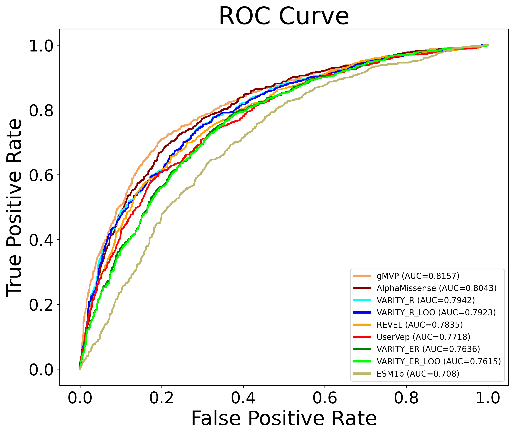
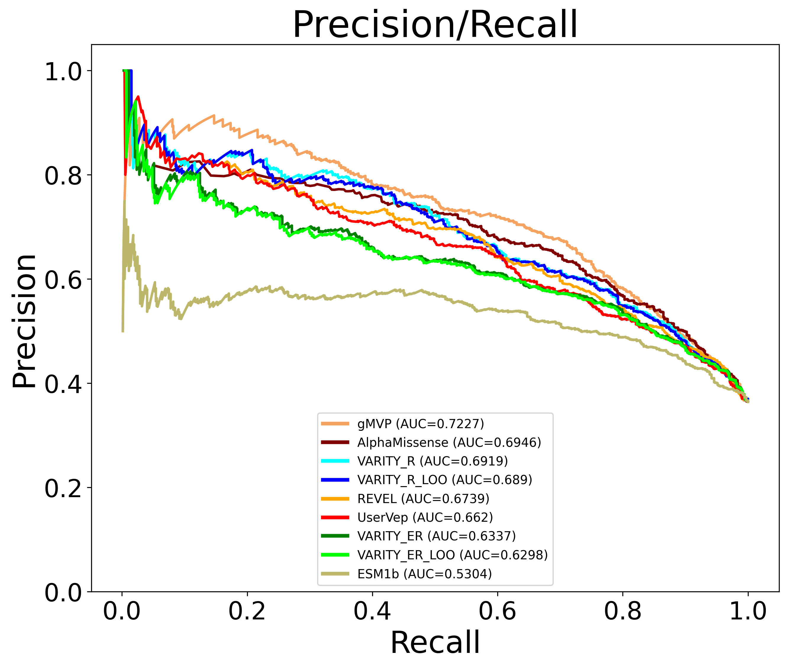

Analysis User Guide
===================

We assume you have issued the following commands as part of the installation::

    init_app –-confdir <config> --logdir <log> --outdir <output> --dbdir <dbdir>

    install_db --confdir <config>

Where <config>, <log>, <output>, <dbdir> are directories where to store
config file, log files, output files containing the results of a benchmarking
analysis, and database files, respectively.

This will create a config file called aigct.yaml in the <config> directory.

The primary input to the analysis is a pandas dataframe of variant effect predictor 
(VEP) scores for a set of variants. The following illustrates the required column
header names and data values required.

===============  ==========  ========  ====================  ====================  ==========
GENOME_ASSEMBLY  CHROMOSOME  POSITION  REFERENCE_NUCLEOTIDE  ALTERNATE_NUCLEOTIDE  RANK_SCORE
===============  ==========  ========  ====================  ====================  ==========
hg38             1            2489207  G                     C                        0.36335
hg38             1            2491274  G                     A                        0.26946
hg38             10          87952158  A                     G                        0.93835
===============  ==========  ========  ====================  ====================  ==========

The GENOME_ASSEMBLY must currently be hg38. The RANK_SCORE is a numeric prediction. It may
or may not be standardized or normalized.

In the examples below. We will refer to "user_vep_scores_df" as the dataframe of
user vep scores. We will refer to <config> as the directory name passed
as a value of the --confdir parameter during the installation.

To run an analysis do the following in a python environment, i.e. jupyter lab::

    import pandas as pd
    from aigct.container import VEBenchmarkContainer

    container = VEBenchmarkContainer("<config>/aigct.yaml")

    analyzer = container.analyzer

    metrics = container.analyzer.compute_metrics(
        "CANCER", user_vep_scores_df, "UserVep", vep_min_overlap_percent=50,
        variant_vep_retention_percent=1, list_variants=True)
    
Metrics is an object that contains the results of the benchmark analysis. See the
the API documentation for the aigct.analyser.VEAnalyzer.compute_metrics method for a detailed
explanation of the parameters passed to that method.

Analysis Summary
----------------

You can view the information stored in the metrics object in various ways.
Run the following code to get a high level textual summary::

    container.reporter.write_summary(metrics)

It will generate output similar to the following::

    Summary metrics for Variant Effect Prediction Benchmark: 2025/02/14 14:05:19

    Total number of user supplied variants: 2000

    Total number of variants across all VEPs in analysis: 2000

    SCORE_SOURCE  NUM_VARIANTS  NUM_POSITIVE_LABELS  NUM_NEGATIVE_LABELS   SOURCE_NAME
    ALPHAM                1987                  709                 1278   AlphaMissense
    ESM1B                 1979                  704                 1275   ESM1b
    EVE                    791                  487                  304   EVE
    GMVP                  1977                  702                 1275   gMVP
    REVEL                 2000                  715                 1285   REVEL
    UserVep               2000                  715                 1285   UserVep
    VAR_ER                1971                  705                 1266   VARITY_ER
    VAR_ERL               1971                  705                 1266   VARITY_ER_LOO
    VAR_R                 1970                  705                 1265   VARITY_R
    VAR_RL                1971                  705                 1266   VARITY_R_LOO

    ROC Metrics

    SCORE_SOURCE  ROC_AUC  EXCEPTION   SOURCE_NAME
    GMVP         0.805173        NaN   gMVP
    ALPHAM       0.788139        NaN   AlphaMissense
    VAR_R        0.782860        NaN   VARITY_R
    VAR_RL       0.780671        NaN   VARITY_R_LOO
    REVEL        0.775701        NaN   REVEL
    UserVep      0.771303        NaN   UserVep
    VAR_ER       0.752789        NaN   VARITY_ER
    VAR_ERL      0.750768        NaN   VARITY_ER_LOO
    EVE          0.733830        NaN   EVE
    ESM1B        0.686284        NaN   ESM1b

    Precision/Recall Metrics

    SCORE_SOURCE   PR_AUC   SOURCE_NAME
    EVE          0.801647   EVE
    GMVP         0.695346   gMVP
    ALPHAM       0.656015   AlphaMissense
    VAR_R        0.654137   VARITY_R
    VAR_RL       0.650803   VARITY_R_LOO
    REVEL        0.648509   REVEL
    UserVep      0.645919   UserVep
    VAR_ER       0.600980   VARITY_ER
    VAR_ERL      0.597045   VARITY_ER_LOO
    ESM1B        0.500446   ESM1b

    Mann-Whitney U -log10(P value)

    SCORE_SOURCE  NEG_LOG10_MWU_PVAL  EXCEPTION   SOURCE_NAME
    GMVP                  111.262129        NaN          gMVP
    ALPHAM                100.034197        NaN AlphaMissense
    VAR_R                  95.752290        NaN      VARITY_R
    VAR_RL                 94.321102        NaN  VARITY_R_LOO
    REVEL                  92.353897        NaN         REVEL
    UserVep                89.468666        NaN       UserVep
    VAR_ER                 76.734006        NaN     VARITY_ER
    VAR_ERL                75.530175        NaN VARITY_ER_LOO
    ESM1B                  42.230547        NaN         ESM1b
    EVE                    27.777576        NaN           EVE

See the the API documentation for the aigct.reporter.VEAnalysisReporter.write_summary
method for a detailed explanation of the parameters passed to that method.

Plot Results
------------

Issue the following to plot the results.

    container.plotter.plot_results(metric)

This will generate a series of presentation ready plots and tables:

* Plot showing ROC curves for the user and system veps allowing for easy
  visual comparison
* Plot showing Precision/Recall curves for the user and system veps.
* Bar graph showing Negative Log10 Mann-Whitney U values for user and system veps.
* Table showing ROC AUC's for user and system veps.
* Table showing Precision/Recall AUC's for user and system veps.
* Table showing Negative Log10 Mann-Whitney U values for user and system veps.

Here is an example of some of the plots generated:

|

|
.. image:: _static/mwu_bar_0.png
   :width: 60 %
   :align: center
|
See the the API documentation for the aigct.plotter.VEAnalysisPlotter.plot_results
method for more details.

Export Results
--------------

Issue the following to export the raw analysis result data underlying the 
plots and tables to csv files that can be used to produce your own plots or to do
further analysis.

    container.exporter.plot_results(metrics, "<export_dir>")

The second parameter is the name of a directory where you want the results to be exported.
It will generate a series of files in a uniquely named subdirectory of this directory.

See the the API documentation for the aigct.exporter.VEAnalysisExporter.export_results
method for more details.

